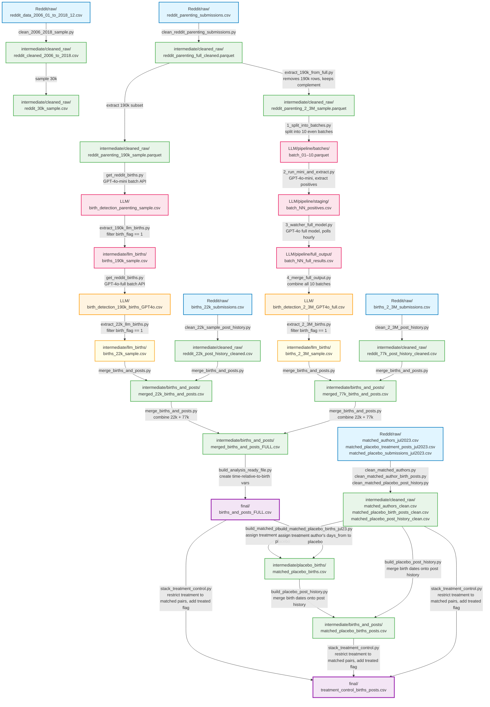

# Reddit Birth Project - Data Lineage

**Purpose:** Visual map of the complete Reddit data pipeline from raw submissions to final analysis datasets.

**Date Created:** 2026-04-07

---

## Data Pipeline Overview

Three parallel pipelines feed into the final stacked analysis file:
1. **22k Treatment Pipeline** — the primary treatment group (completed)
2. **2.3M Pipeline** — large-scale LLM birth detection (completed)
3. **Placebo Control Pipeline** — matched controls with assigned birth dates

---

## Pipeline Stages Explained

### **Stage 1: Clean Raw Data**

| Script | Input | Output |
|--------|-------|--------|
| `clean_2006_2018_sample.py` | `Reddit/raw/reddit_data_2006_01_to_2018_12.csv` | `reddit_cleaned_2006_to_2018.csv`, `reddit_30k_sample.csv` |
| `clean_reddit_parenting_submissions.py` | Reddit API / r/Parenting raw submissions | `reddit_parenting_full_cleaned.parquet`, `reddit_parenting_190k_sample.parquet` |
| `extract_190k_from_full.py` | `reddit_parenting_full_cleaned.parquet` + `reddit_parenting_190k_sample.parquet` | `reddit_parenting_2_3M_sample.parquet` (full minus 190k) |
| `clean_22k_sample_post_history.py` | `Reddit/raw/births_22k_submissions.csv` | `reddit_22k_post_history_cleaned.csv` |
| `clean_matched_authors.py` | `Reddit/raw/matched_authors_jul2023.csv` | `matched_authors_clean.csv` |
| `clean_matched_author_birth_posts.py` | `Reddit/raw/matched_placebo_treatment_posts_jul2023.csv` | `matched_placebo_birth_posts_clean.csv` |
| `clean_matched_placebo_post_history.py` | `Reddit/raw/matched_placebo_submissions_jul2023.csv` | `matched_placebo_post_history_clean.csv` |

The three matched placebo cleaning scripts run in parallel and apply the same cleaning steps (drop deleted authors, drop null ids, drop empty posts) with no top-5% trim (matched pairs must be preserved).

---

### **Stage 2a: LLM Birth Detection — 190k Sample**

Two-pass GPT-4o detection on the 190k parenting sample, yielding ~22k confirmed births.

| Script | Input | Output |
|--------|-------|--------|
| `get_reddit_births.py` | `reddit_parenting_190k_sample.parquet` | `birth_detection_parenting_sample.csv` |
| `extract_190k_llm_births.py` | `birth_detection_parenting_sample.csv` + `reddit_parenting_190k_sample.csv` | `births_190k_sample.csv` |
| `get_reddit_births.py` (2nd pass) | `births_190k_sample.csv` | `birth_detection_190k_births_GPT4o.csv` |
| `extract_22k_llm_births.py` | `birth_detection_190k_births_GPT4o.csv` + `births_190k_sample.csv` | `births_22k_sample.csv` |

---

### **Stage 2b: LLM Birth Detection — 2.3M Pipeline**

Mini → full model two-stage pipeline with continuous watcher. Runs in parallel with Stage 2a.

| Script | Input | Output |
|--------|-------|--------|
| `1_split_into_batches.py` | `reddit_parenting_2_3M_sample.parquet` | `batch_01.parquet` – `batch_10.parquet` |
| `2_run_mini_and_extract.py` | `batch_NN.parquet` | `batch_NN_positives.csv` (mini positives only) |
| `3_watcher_full_model.py` | `batch_NN_positives.csv` (polls hourly) | `batch_NN_full_results.csv` |
| `4_merge_full_output.py` | All `batch_*_full_results.csv` | `birth_detection_2_3M_GPT4o_full.csv` |
| `extract_2_3M_births.py` | `birth_detection_2_3M_GPT4o_full.csv` + `reddit_parenting_2_3M_sample.parquet` | `births_2_3M_sample.csv` |

---

### **Stage 3: Merge & Build Analysis File**

| Script | Input | Output |
|--------|-------|--------|
| `merge_births_and_posts.py` | `births_22k_sample.csv` + `reddit_22k_post_history_cleaned.csv` | `merged_22k_births_and_posts.csv` |
| `build_analysis_ready_file.py` | `merged_22k_births_and_posts.csv` | `births_and_posts_22k.csv` (adds `days_from_birth`, `months_from_birth`, etc.) |

---

### **Stage 4: Placebo Control**

| Script | Input | Output |
|--------|-------|--------|
| `build_matched_placebo_births_jul23.py` | `matched_authors_clean.csv` + `matched_placebo_birth_posts_clean.csv` + `births_and_posts_FULL.csv` | `matched_placebo_births.csv` |
| `build_placebo_post_history.py` | `matched_placebo_births.csv` + `matched_placebo_post_history_clean.csv` | `matched_placebo_births_posts.csv` |
| `stack_treatment_control.py` | `births_and_posts_FULL.csv` + `matched_placebo_births_posts.csv` + `matched_authors_clean.csv` | `treatment_control_births_posts.csv` |

`build_matched_placebo_births_jul23.py` assigns each placebo author the same `days_from` as their matched treatment author (looked up from `births_and_posts_FULL.csv`), then computes `date_birth` from the placebo birth post's `created_utc` minus that `days_from`. `stack_treatment_control.py` restricts the treatment group to authors who have a matched placebo pair before stacking.

---

## Final Analysis-Ready Datasets

### `final/births_and_posts_FULL.csv` — Treatment Group
**Structure:** One row per post, with time-relative-to-birth variables
**Key variables:** `date_birth`, `days_from_birth`, `months_from_birth`, `full_18_pre`, `one_year_pre`, `full_18_post`, `female`, `treated`

### `final/treatment_control_births_posts.csv` — Combined Treatment + Control ⭐ PRIMARY
**Structure:** Treatment group stacked with matched placebo controls (one treatment author per placebo author)
**Key variable:** `treated` (1 = confirmed Reddit birth poster, 0 = matched control)

---

## Color Key (Diagram)

| Color | Meaning |
|-------|---------|
| Blue | Raw input files |
| Green | Cleaned / intermediate data |
| Orange | LLM detection outputs |
| Pink | LLM pipeline batch files |
| Yellow | Extracted birth samples |
| Purple | Final analysis-ready files |

---

**Last Updated:** 2026-04-13
**Project Directory:** `D:/TwitterBirth/Reddit/`
