# Twitter Birth Project - Complete Data Lineage

**Purpose:** Visual map of the complete data pipeline from initial Twitter scraping to final analysis datasets.

**Date Created:** 2026-02-09

---

## Data Pipeline Overview

This project follows a multi-stage pipeline combining Python (data collection, LLM classification) and Stata (data preparation, analysis). **The 2013-2017 and 2018 datasets follow parallel but different pipelines**, particularly in the hand coding stage.

```mermaid
flowchart TD
    %% ========== 2013-2017 PIPELINE ==========
    %% Stage 1: Initial Twitter Scraping (2013-2017)
    A1[Twitter API<br/>Full Archive 2013-2017] -->|get_tweets.py| B1[data/raw/query_results_<br/>2013_01_01-2017_12_31.csv]

    %% Stage 2: LLM Classification - Text (2013-2017)
    B1 -->|batch_classify_text.py<br/>begin_date='2013_01_01'| C1[data/raw/classified_text_<br/>2013_01_01-2017_12_31.csv]

    %% Stage 2b: LLM Classification - Images (2013-2017)
    C1 -->|batch_classify_images.py<br/>begin_date='2013_01_01'| D1[data/raw/classified_images_<br/>2013_01_01-2017_12_31.csv]
    D1 --> E1[data/raw/hand_coding/<br/>to_hand_code_2013_01_01-2017_12_31.csv]

    %% Stage 3: Hand Coding Pipeline (2013-2017)
    E1 -->|hand_coding_split_2018.do<br/>Auto-coding rules| F1[data/raw/hand_coding/<br/>to_hand_code_master_2013_2017.csv]
    F1 -->|Manual coding<br/>18 RAs + Rory| G1[data/raw/hand_coding/2013_2017/<br/>hand_coded_master_2013_2017.csv]

    %% Stage 4: Longitudinal Data Collection (2013-2017)
    G1 -->|get_tweet_volume_by_user.py<br/>year='2013_2017'| H1[data/raw/tweet_volume_by_user_2013_2017.csv]
    G1 -->|get_rt_reply_volume.py<br/>year='2013_2017'| H2[data/raw/retweet_reply_volume_by_user_2013_2017.csv]
    G1 -->|get_tweet_volume_by_user.py<br/>Creates user_info| H3[data/raw/user_info_2013_2017.csv]
    G1 -->|get_tweets_by_user.py| H4[data/raw/tweets_by_user_2013_2017.csv]

    %% Stage 5: Demographics Extraction (2013-2017)
    H3 -->|get_demographics_update.py<br/>YEAR='2013_2017'| I1[data/raw/user_info_with_demographics_2013_2017.csv]

    %% ========== 2018 PIPELINE ==========
    %% Stage 1: Initial Twitter Scraping (2018)
    A2[Twitter API<br/>2018 Data] -->|get_tweets.py<br/>Different date range| B2[data/raw/query_results_<br/>2018_01_01-2018_12_31.csv]

    %% Stage 2: LLM Classification - Text (2018)
    B2 -->|batch_classify_text.py<br/>begin_date='2018_01_01'| C2[data/raw/classified_text_<br/>2018_01_01-2018_12_31.csv]

    %% Stage 2b: LLM Classification - Images (2018)
    C2 -->|batch_classify_images.py<br/>begin_date='2018_01_01'| D2[data/raw/classified_images_<br/>2018_01_01-2018_12_31.csv]
    D2 --> E2[data/raw/hand_coding/2018/<br/>to_hand_code_2018_01_01-2018_12_31.csv]

    %% Stage 3: Hand Coding Pipeline (2018 - DIFFERENT!)
    E2 -->|hand_coding_split_2018.do<br/>Lines 1-34 COMMENTED OUT<br/>3 coders only| F2[data/raw/hand_coding/2018/<br/>hand_coded_master_2018.csv]

    %% Note: Archive file (source unknown)
    ARCH[⚠️ data/archive/hand_coded_2018.csv<br/>SOURCE UNKNOWN] -.->|Original input<br/>now commented| F2

    %% Stage 4: Longitudinal Data Collection (2018)
    F2 -->|get_tweet_volume_by_user.py<br/>year='2018'| J1[data/raw/tweet_volume_by_user_2018.csv]
    F2 -->|get_rt_reply_volume.py<br/>year='2018'| J2[data/raw/retweet_reply_volume_by_user_2018.csv]
    F2 -->|get_tweet_volume_by_user.py<br/>Creates user_info| J3[data/raw/user_info_2018.csv]
    F2 -->|get_tweets_by_user.py| J4[data/raw/tweets_by_user_2018.csv]

    %% Stage 5: Demographics Extraction (2018)
    J3 -->|get_demographics_update.py<br/>YEAR='2018'| K1[data/raw/user_info_with_demographics_2018.csv]

    %% ========== MERGING BOTH DATASETS ==========
    %% Stage 6: Stata Data Preparation - Merging
    H1 & H2 & I1 & H4 & J1 & J2 & K1 & J4 -->|prep_data.do<br/>MASTER MERGE<br/>Combines 2018 + 2013-2017| L1[data/cleaned/tweet_volume_by_user_full_sample.dta]
    H1 & H2 & I1 & H4 & J1 & J2 & K1 & J4 -->|prep_data.do| L2[data/cleaned/user_info_full_sample.dta]
    H1 & H2 & I1 & H4 & J1 & J2 & K1 & J4 -->|prep_data.do| L3[data/cleaned/tweets_by_user_full_sample.dta]

    %% Stage 7: Final Cleaning
    L1 -->|final_cleaning_3_datasets.do<br/>Convert types, remove outliers,<br/>create time variables| M1[data/final/tweet_volume_by_user_<br/>full_sample_CLEAN.dta]
    L2 -->|final_cleaning_3_datasets.do<br/>Validate births, drop duplicates,<br/>keep first birth only| M2[data/final/user_info_<br/>full_sample_CLEAN.dta]
    L3 -->|final_cleaning_3_datasets.do<br/>Merge indicators,<br/>create derived variables| M3[data/final/tweets_by_user_<br/>full_sample_CLEAN.dta]

    %% Final Analysis
    M1 & M2 & M3 -->|Statistical Analysis| N[Final Research Output]

    %% Styling
    classDef rawData fill:#e1f5ff,stroke:#0077be,stroke-width:2px
    classDef pythonProcess fill:#fff4e1,stroke:#ff9900,stroke-width:2px
    classDef stataProcess fill:#e8f5e9,stroke:#4caf50,stroke-width:2px
    classDef finalData fill:#f3e5f5,stroke:#9c27b0,stroke-width:3px
    classDef handCoding fill:#fff3e0,stroke:#ff6f00,stroke-width:2px
    classDef warning fill:#ffebee,stroke:#c62828,stroke-width:2px,stroke-dasharray: 5 5

    class B1,C1,D1,E1,H1,H2,H3,H4,I1 rawData
    class B2,C2,D2,E2,J1,J2,J3,J4,K1 rawData
    class L1,L2,L3 stataProcess
    class M1,M2,M3 finalData
    class F1,G1,F2 handCoding
    class ARCH warning
```



---

## Pipeline Stages Explained

### **Stage 1: Initial Twitter Scraping** 🐦
**Script:** `scripts/py/twitter_scraping_code/get_tweets.py`

**Inputs:**
- Twitter API (Full Archive)

**Outputs:**
- **2013-2017:** `data/raw/query_results_2013_01_01-2017_12_31.csv` (RAW DATA SOURCE)
- **2018:** `data/raw/query_results_2018_01_01-2018_12_31.csv`

**What it does:**
- Queries Twitter's full archive API
- Uses 10 different birth announcement search patterns
- **Note:** Script uses hardcoded date variables (lines 22-23) - change `begin_date` and `end_date` to process different time periods

---

### **Stage 2: LLM Classification** 🤖

#### Text Classification
**Script:** `scripts/py/batch_classify_text.py`

**Inputs:**
- **2013-2017:** `data/raw/query_results_2013_01_01-2017_12_31.csv`
- **2018:** `data/raw/query_results_2018_01_01-2018_12_31.csv`

**Outputs:**
- **2013-2017:** `data/raw/classified_text_2013_01_01-2017_12_31.csv`
- **2018:** `data/raw/classified_text_2018_01_01-2018_12_31.csv`
- `data/json/batch_requests_{begin_date}-{end_date}_batch_*.jsonl` (temporary)

**What it does:**
- Uses OpenAI GPT-4 Batch API
- Chain-of-thought reasoning to identify birth announcements
- Preprocesses text (removes links, mentions, unwanted emojis)
- **Note:** Change `begin_date` and `end_date` variables (lines 22-23) to process different time periods

#### Image Classification
**Script:** `scripts/py/batch_classify_images.py`

**Inputs:**
- **2013-2017:** `data/raw/classified_text_GPT4_2013_01_01-2017_12_31.csv` ⚠️ **Note:** Source script for GPT4 naming not found - may be manual rename
- **2018:** `data/raw/classified_text_GPT4_2018_01_01-2018_12_31.csv` (found in archive)

**Outputs:**
- **2013-2017:** `data/raw/classified_images_2013_01_01-2017_12_31.csv` + `data/raw/hand_coding/to_hand_code_2013_01_01-2017_12_31.csv`
- **2018:** `data/raw/classified_images_2018_01_01-2018_12_31.csv` + `data/raw/hand_coding/2018/to_hand_code_2018_01_01-2018_12_31.csv`
- `data/json/batch_image_requests_{begin_date}-{end_date}_batch_*.jsonl` (temporary)

**What it does:**
- Analyzes images from tweets flagged by text classifier
- GPT-4 vision model evaluates if images show newborns
- **Note:** Change `begin_date` and `end_date` variables (lines 18-19) to process different time periods

---

### **Stage 3: Hand Coding Validation** ✍️

**⚠️ IMPORTANT:** The 2018 and 2013-2017 hand coding processes differ significantly!

---

#### **2013-2017 Hand Coding Pipeline** (18 RAs + Rory)

**Auto-Coding**
**Script:** `scripts/do/hand_coding/hand_coding_split_2018.do` (lines 39-79, ACTIVE)

**Inputs:**
- `data/raw/hand_coding/to_hand_code_2013_01_01-2017_12_31.csv`

**Outputs:**
- `data/raw/hand_coding/to_hand_code_master_2013_2017.csv`

**What it does:**
- Applies keyword patterns to identify obvious non-births
- Filters duplicates (≥10 identical tweets)
- Flags anniversaries and retweets

**Manual Coding**
**Process:** 18 research assistants + Rory (reference coder)

**Inputs:**
- `data/raw/hand_coding/to_hand_code_master_2013_2017.csv`

**Outputs:**
- `data/raw/hand_coding/RA_training/hand_coded_[RA_Names].csv` (one per RA)
- `data/raw/hand_coding/2013_2017/first_500_rory.csv`

**What it does:**
- Each tweet manually validated as birth announcement (YES/NO)
- Inter-rater reliability evaluated (`RA_eval.do`)

**Consolidation**
**Script:** `scripts/do/hand_coding/merge_hand_coded_2013_2017.do`

**Inputs:**
- `data/raw/hand_coding/2013_2017/partially_hand_coded_master_2013_2017.csv` (auto-coded)
- `data/raw/hand_coding/2013_2017/first_500_rory.csv`
- `data/raw/hand_coding/2013_2017/hand_coded_[RA_Names].csv` (18 files)

**Outputs:**
- `data/raw/hand_coding/2013_2017/hand_coded_master_2013_2017.csv` ✅ **VALIDATED BIRTHS (2013-2017)**

**What it does:**
- Merges all RA-coded files
- Resolves conflicts
- Removes duplicate births (within 546 days)

---

#### **2018 Hand Coding Pipeline** (3 coders only)

**Script:** `scripts/do/hand_coding/hand_coding_split_2018.do` (lines 1-34, **NOW COMMENTED OUT**)

**Inputs:**
- ⚠️ `data/archive/hand_coded_2018.csv` (SOURCE UNKNOWN - file exists but creation script not found)

**Process (from commented code):**
- Split top 6,000 tweets among 3 coders: Rory, Bolun, Min
- Lines 21-23: Assigned first 3,000 to Bolun, next 3,000 to Min, remainder to Rory
- Created individual files: `to_hand_code_Rory.csv`, `to_hand_code_Bolun.csv`, `to_hand_code_Min.csv`

**Outputs:**
- `data/raw/hand_coding/2018/hand_coded_master_2018.csv` ✅ **VALIDATED BIRTHS (2018)**

**What it does:**
- Manual validation by 3 coders (less comprehensive than 2013-2017)
- **Note:** This process is now historical - code is commented out

---

#### **Merging 2018 + 2013-2017** (Historical - now in archive)

**Script:** `scripts/do/testing/Trouble Shooting/query_exploring.do` (lines 173-191, COMMENTED OUT)

**Process:**
1. Load `hand_coded_master_2013_2017.csv` → save as temp
2. Load `hand_coded_master_2018.csv`
3. Append (stack) both datasets
4. Save as `data/archive/hand_coded_master_full_sample.dta`

**Note:** This merging is now handled differently in the active pipeline (see Stage 6: prep_data.do)

---

### **Stage 4: Longitudinal Data Collection** 📊

Using the validated birth announcements, collect 18 months pre/post birth data. **Same scripts used for both datasets** by changing the `year` variable.

#### Volume Data
**Script:** `scripts/py/twitter_scraping_code/get_tweet_volume_by_user.py`

**Inputs:**
- **2013-2017:** `data/raw/hand_coding/2013_2017/hand_coded_master_2013_2017.csv` (set `year = "2013_2017"` at line 25)
- **2018:** `data/raw/hand_coding/2018/hand_coded_master_2018.csv` (set `year = "2018"` at line 25)
- Twitter API (user timeline)

**Outputs:**
- **2013-2017:** `data/raw/tweet_volume_by_user_2013_2017.csv` + `data/raw/user_info_2013_2017.csv`
- **2018:** `data/raw/tweet_volume_by_user_2018.csv` + `data/raw/user_info_2018.csv`

**What it does:**
- Fetches daily original tweet counts for 18 months pre/post birth
- Creates user metadata file with account info

---

**Script:** `scripts/py/twitter_scraping_code/get_rt_reply_volume.py`

**Inputs:**
- **2013-2017:** `data/raw/hand_coding/2013_2017/hand_coded_master_2013_2017.csv` (set `year = "2013_2017"` at line 24)
- **2018:** `data/raw/hand_coding/2018/hand_coded_master_2018.csv` (set `year = "2018"` at line 24)
- Twitter API (counts endpoint)

**Outputs:**
- **2013-2017:** `data/raw/retweet_reply_volume_by_user_2013_2017.csv`
- **2018:** `data/raw/retweet_reply_volume_by_user_2018.csv`

**What it does:**
- Fetches daily retweet and reply counts for 18 months pre/post birth

---

#### Tweet Text
**Script:** `scripts/py/twitter_scraping_code/get_tweets_by_user.py`

**Inputs:**
- **2013-2017:** `data/raw/tweet_volume_by_user_2013_2017.csv`
- **2018:** `data/raw/tweet_volume_by_user_2018.csv`
- Twitter API (full archive)

**Outputs:**
- **2013-2017:** `data/raw/tweets_by_user_2013_2017.csv`
- **2018:** `data/raw/tweets_by_user_2018.csv`

**What it does:**
- Fetches full tweet text for each user
- Includes engagement metrics (likes, retweets, quotes, replies)
- **Note:** Script may use date variables - check lines 20-30 for configuration

---

### **Stage 5: Demographics Extraction** 👤

**Script:** `scripts/py/LLM_demographics/get_demographics_update.py`

**Inputs:**
- **2013-2017:** `data/raw/user_info_2013_2017.csv` (set `YEAR = "2013_2017"` at line 19)
- **2018:** `data/raw/user_info_2018.csv` (set `YEAR = "2018"` at line 19)
- OpenAI API (GPT-4 with vision)

**Outputs:**
- **2013-2017:** `data/raw/user_info_with_demographics_2013_2017.csv`
- **2018:** `data/raw/user_info_with_demographics_2018.csv`
- `data/json/batch_requests_gender_batch_*.jsonl` (temporary)
- `data/json/batch_requests_race_batch_*.jsonl` (temporary)
- `data/json/batch_requests_occupation_batch_*.jsonl` (temporary)
- `data/json/batch_requests_children_batch_*.jsonl` (temporary)

**What it does:**
Uses OpenAI GPT-4 with multimodal analysis (text + images):
- **Gender:** Name, username, description, profile image
- **Race:** Name, profile image
- **Occupation:** Profile description
- **Number of children:** Birth announcement text

**Note:** Same script processes both years - just change the `YEAR` variable to run for different datasets

---

## Key Differences: 2018 vs 2013-2017 Pipelines

| Stage | 2013-2017 | 2018 | Same Script? |
|-------|-----------|------|--------------|
| **1. Initial Scraping** | `query_results_2013_01_01-2017_12_31.csv` | `query_results_2018_01_01-2018_12_31.csv` | ✅ `get_tweets.py` (change date vars) |
| **2. Text Classification** | `classified_text_2013_01_01-2017_12_31.csv` | `classified_text_2018_01_01-2018_12_31.csv` | ✅ `batch_classify_text.py` (change date vars) |
| **3. Image Classification** | `classified_images_2013_01_01-2017_12_31.csv` | `classified_images_2018_01_01-2018_12_31.csv` | ✅ `batch_classify_images.py` (change date vars) |
| **4. Hand Coding** | **18 RAs + Rory** (active code in `hand_coding_split_2018.do` lines 39-79) | **3 coders only** (Rory, Bolun, Min - now commented out lines 1-34) | ❌ **DIFFERENT PROCESS** |
| **5. Volume Collection** | `tweet_volume_by_user_2013_2017.csv` | `tweet_volume_by_user_2018.csv` | ✅ `get_tweet_volume_by_user.py` (change year var) |
| **6. RT/Reply Volume** | `retweet_reply_volume_by_user_2013_2017.csv` | `retweet_reply_volume_by_user_2018.csv` | ✅ `get_rt_reply_volume.py` (change year var) |
| **7. Tweet Text** | `tweets_by_user_2013_2017.csv` | `tweets_by_user_2018.csv` | ✅ `get_tweets_by_user.py` |
| **8. Demographics** | `user_info_with_demographics_2013_2017.csv` | `user_info_with_demographics_2018.csv` | ✅ `get_demographics_update.py` (change YEAR var) |
| **9. Final Merge** | Both datasets merged in `prep_data.do` → `*_full_sample.dta` | Both datasets merged in `prep_data.do` → `*_full_sample.dta` | ✅ `prep_data.do` (handles both) |

### Script Variable Patterns

Most Python scripts use configurable variables to process different time periods:

```python
# Pattern 1: Date range variables (change these to process different periods)
begin_date = "2013_01_01"  # or "2018_01_01"
end_date = "2017_12_31"    # or "2018_12_31"

# Pattern 2: Year variables (change to process different datasets)
YEAR = "2018"              # or "2013_2017"
year = "2013_2017"         # or "2018"

# Pattern 3: File paths constructed using variables
INPUT_PATH = f"data/raw/user_info_{YEAR}.csv"
OUTPUT_PATH = f"data/raw/user_info_with_demographics_{YEAR}.csv"
```

### Missing Documentation

⚠️ **Files without clear source:**
1. `data/archive/hand_coded_2018.csv` - Input to 2018 hand coding process (source unknown)
2. `data/raw/classified_text_GPT4_*.csv` - Scripts output `classified_text_*.csv` (without "GPT4")

---

### **Stage 6: Stata Data Preparation** 📁

#### Master Merge
**Script:** `scripts/do/data_prep/prep_data.do`

**Inputs:**
- `data/raw/tweet_volume_by_user_2018.csv`
- `data/raw/retweet_reply_volume_by_user_2018.csv`
- `data/raw/user_info_with_demographics_2018.csv`
- `data/raw/tweet_volume_by_user_2013_2017.csv`
- `data/raw/retweet_reply_volume_by_user_2013_2017.csv`
- `data/raw/user_info_with_demographics_2013_2017.csv`
- `data/raw/tweets_by_user_2013_2017.csv`
- `data/raw/user_info_genderx2check.dta`

**Outputs:**
- `data/cleaned/tweet_volume_by_user_full_sample.dta`
- `data/cleaned/user_info_full_sample.dta`
- `data/cleaned/tweets_by_user_full_sample.dta`
- `data/raw/tweets_by_user_full_sample.csv`

**What it does:**
1. Merges tweet volume with retweet/reply volume (by author_id + date)
2. Appends 2018 + 2013-2017 data → "full_sample"
3. Merges user demographics
4. Creates `unique_id` (author_id + birth_date)
5. Validates data completeness

---

### **Stage 7: Final Cleaning** ✨

**Script:** `scripts/do/data_prep/final_cleaning_3_datasets.do`

**Inputs:**
- `data/cleaned/user_info_full_sample.dta`
- `data/cleaned/tweet_volume_by_user_full_sample.dta`
- `data/cleaned/tweets_by_user_full_sample.dta`

**Outputs (FINAL ANALYSIS DATASETS):**
- ✅ `data/final/user_info_full_sample_CLEAN.dta`
- ✅ `data/final/tweet_volume_by_user_full_sample_CLEAN.dta`
- ✅ `data/final/tweets_by_user_full_sample_CLEAN.dta`
- `data/cleaned/user_info_full_sample_CLEAN.dta` (copy)
- `data/cleaned/tweet_volume_by_user_full_sample_CLEAN.dta` (copy)
- `data/cleaned/tweets_by_user_full_sample_CLEAN.dta` (copy)

**What it does:**
1. **Type conversions:** Strings → numeric/date formats
2. **Validation:** Birth announcements must be within ±14 days of birth
3. **Deduplication:** Remove duplicate births, keep first birth only
4. **Time variables:** Create days/weeks/months from birth
5. **Derived variables:** Add indicators (full_3years, no_rt_reply, acct_tweeted_postBA)
6. **Outlier removal:** Filter invalid records

---

## Final Analysis-Ready Datasets

### 1️⃣ **User Information Dataset**
**File:** `data/final/user_info_full_sample_CLEAN.dta`

**Structure:** One row per user (first birth only)

**Key Variables:**
- `author_id` - Twitter user ID
- `unique_id` - author_id + birth_date
- `date_birth` - Actual birth date
- `date_birth_tweet` - Birth announcement tweet date
- `female` - Gender (1=female, 0=male, -99=uncertain)
- `race` - Race/ethnicity (1=Black, 2=White, 3=Asian, 4=Hispanic, 5=Other, -99=uncertain)
- `occupation` - Occupation category (1-9, -99=uncertain)
- `num_children` - Number of children mentioned in tweet
- `account_created_at` - Twitter account creation date
- `followers_count`, `following_count`, `tweet_count`

**Sample Criteria:**
- First birth only per account
- Birth announcement within ±14 days of birth
- No duplicate unique_ids

---

### 2️⃣ **Tweet Volume Dataset** ⭐ PRIMARY ANALYSIS FILE
**File:** `data/final/tweet_volume_by_user_full_sample_CLEAN.dta`

**Structure:** Panel data (author_id × date)

**Key Variables:**
- `author_id` - Twitter user ID
- `date` - Calendar date
- `tweets_original` - Count of original tweets (not retweets)
- `tweets_quote` - Count of quote tweets
- `tweets_retweet` - Count of retweets
- `tweets_reply` - Count of replies
- `tweets_total` - Total tweets (original + quote + retweet + reply)
- **Time-relative variables:**
  - `t` - Days from birth (negative = pre-birth, positive = post-birth)
  - `weeks_from_birth` - Weeks from birth
  - `months_from_birth` - Months from birth
  - `post_birth` - Indicator (0=pre-birth, 1=post-birth)

**Time Window:** 18 months pre-birth + 18 months post-birth

**Used For:** Longitudinal analysis of tweeting behavior changes

---

### 3️⃣ **Tweet Text Dataset**
**File:** `data/final/tweets_by_user_full_sample_CLEAN.dta`

**Structure:** One row per tweet

**Key Variables:**
- `author_id` - Twitter user ID
- `tweet_id` - Unique tweet identifier
- `text` - Full tweet text
- `created_at` - Tweet timestamp
- `like_count`, `retweet_count`, `quote_count`, `reply_count`
- `is_ba_tweet` - Indicator (1 if this is the birth announcement tweet)
- Sentiment scores (if `sentiment_analysis.py` was run)

**Used For:** Text analysis, sentiment analysis, content analysis

---

## Key Statistics

### Sample Sizes (Typical)
- Initial Twitter query: ~100,000+ tweets
- After LLM classification: ~10,000-20,000 flagged
- After hand coding validation: ~5,000-10,000 confirmed births
- Final analysis sample: ~3,000-5,000 users (first births only)
- Tweet volume observations: ~1,000,000+ (users × daily observations)

### Time Periods
- **2013-2017:** Full archive search
- **2018:** Separate cohort for validation
- **Longitudinal window:** 18 months pre + 18 months post birth

### Quality Controls
- Inter-rater reliability: 18 RAs evaluated against reference coder
- Birth timing validation: ±14 days
- Duplicate removal: Multiple births per account filtered
- Data completeness: Full 18-month observation window required (for some analyses)

---

## File Naming Conventions

### Year Indicators
- `*_2013_2017.*` - Data from 2013-2017 period
- `*_2018.*` - Data from 2018 period
- `*_full_sample.*` - Combined 2013-2017 + 2018 data

### Status Indicators
- `data/raw/*` - Raw data from Python scripts or Twitter API
- `data/cleaned/*` - Intermediate Stata files (type conversions, basic cleaning)
- `data/final/*_CLEAN.dta` - Final analysis-ready datasets

### File Types
- `.csv` - Raw data from Python or for hand coding
- `.dta` - Stata datasets
- `.jsonl` - OpenAI Batch API request/response files (temporary)

---

## Critical Dependencies

### External APIs
- Twitter API (full archive + recent search)
- OpenAI API (GPT-4 + GPT-4 Vision)

### Python Packages
- `openai` - GPT-4 API access
- `pandas` - Data manipulation
- `transformers` - Sentiment analysis (Twitter-RoBERTa)

### Stata Packages
- `asdoc` - Summary statistics tables
- `areg` - Fixed effects regression (absorb command)

---

## Next Steps for Analysis

With the final datasets, you can now:

1. **Descriptive Analysis**
   - Run `scripts/do/data_prep/descriptives.do`
   - Generates demographic summaries and visualizations

2. **Volume Analysis**
   - Run `scripts/do/data_prep/percent_changes.do` (pre/post comparison)
   - Run `scripts/do/data_prep/volume_FE.do` (fixed effects models)

3. **Custom Analysis**
   - Load `data/final/tweet_volume_by_user_full_sample_CLEAN.dta`
   - Analyze changes in tweeting behavior around birth events

---

## Documentation Files

- **Python Scripts:** `scripts/py/script_tracking.md`
- **Stata Scripts:** `scripts/do/script_tracking_do.md`
- **This Data Lineage:** `data_lineage.md`
- **Best Practices:** `scripts/SCRIPT_BEST_PRACTICES.md`

---

**Last Updated:** 2026-02-09
**Project Directory:** `D:/TwitterBirth`
